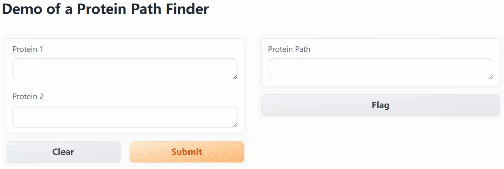

## Fetching protein path

### Demo

Here's a GUI demo of this protein path finder project.



You may use
```bash
python demo.py
```
to open up your own GUI demo at http://127.0.0.1:7860 locally. Make sure you have ```gradio``` package installed.

### Introduction
As is known, proteins interact with each other intracellularly, which has led to a series of studies focusing on revealing the relationships between different proteins. Moreover, when we learn about a specific pathway or function centered on one specific protein, we need to get a general idea of other related proteins and pathways to help us better understand what we are doing or even pop up with new ideas that we can work on.

Thus, we are interested to develop a tool to assist with deciding the shortest pathway between two interested proteins.

### Methods

We use selenium to get all sourcecode of the HPRD database, then select all proteins with their interactors, saving them as dictionaries for further use. We used data from [NetPath](http://www.netpath.org).

Considering the difficulty that may arise during the process of deciding the interaction intensity between proteins, we assume that all intensity of interactions stay the same for various proteins. As a result, the shortest path between two proteins is a pathway that contains the least number of proteins. Thus we use BSF to figure out the shortest interaction pathway.

### Try From Scratch
If you would like to try from scratch, make sure the following packages are installed
```python
selenium # selenium 4 is required for Edge
numpy
re
```
We are using Microsoft Edge as the browser to visit website and collect data. Make sure webdriver for Edge is installed. Then run the following command to start crawling data.
```bash
python crawl.py --start $start_protein_id --step $number_of_ids
```
Note that NetPath have lots of blank ids.

### Usage
We have collected part of the data from NetPath, around 2000 proteins(as shown in file [```protein_list.txt```](https://github.com/RafaDD/Protein-Path-with-Netpath/blob/main/protein_list.txt)) and their path to other proteins. Use the following command to run. If you are using GUI, then refer to Demo instead.

```bash
python run.py
```

Input two proteins of your interest, then a shortest interaction pathway of these two proteins will be returned as a result.

_Example 1:_
```
Protein1 : mapk10
Protein2 : rab5
Path:
MAPK10 -> MADD -> TNFRSF1A -> TNF -> TRADD -> AKT1 -> APPL1 -> RAB5
```
_Example 2:_
```
Protein1 : casp1 
Protein2 : rab5
Path:
CASP1 -> EGFR -> EPS8 -> USP6NL -> RAB5
```
